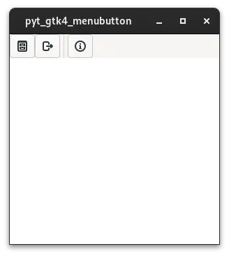

# pyt_gtk4_menubutton

 

## 内容

Gtk.MenuButtonやGtk.Buttonを使用してアイコンの並ぶメニューバーを表示します。①Buttonを押した場合にGtk.PopupMenuを表示するものをGtk.MenuButtonで作成し、②押した場合に処理をおこなうものをGtk.Buttonで作成します。  
uiの作成には、cambalacheを使用します。

 

 

## 履歴

2024/6/8 プログラム作成。  
Gtk.MenuButtonを押した場合に表示するGtk.PopoverMenuもuiファイルに記入しようとしたがエラーが出てしまい、実現できませんでした。このため、Gtk.PopoverMenuはPython側で定義して、それにmodelを指定して、Gtk.MenuButtonにセットしました。

## 参考にしたHP
